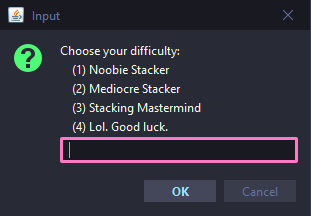
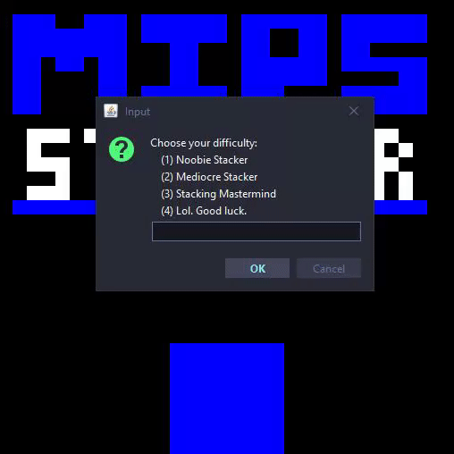
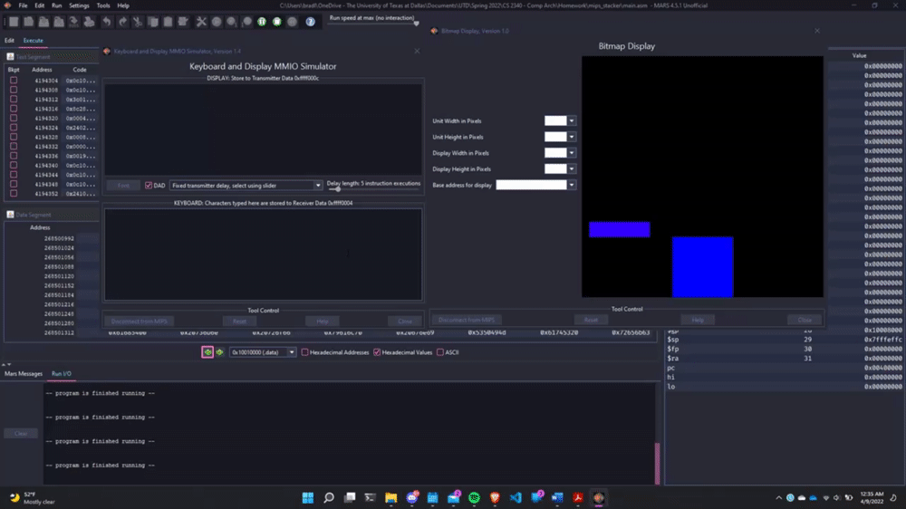
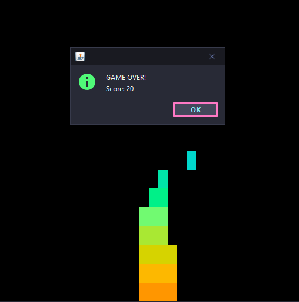
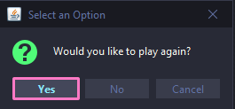
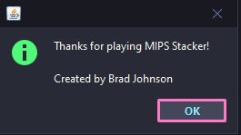
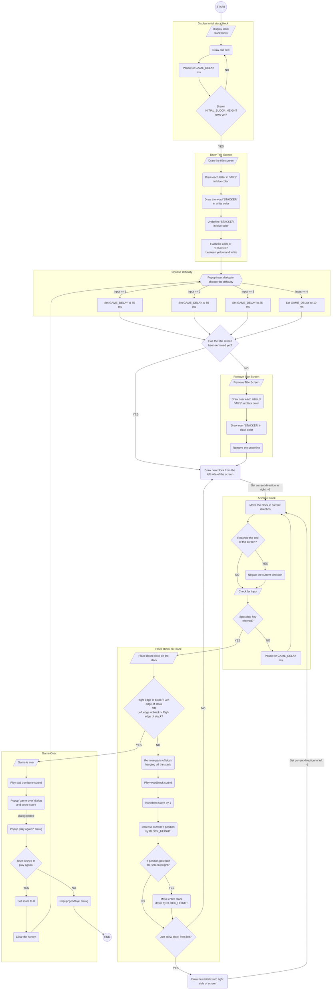

# MIPS Stacker

## An endless 2D stacker game implemented with MIPS using the MARS 4.5.1 Bitmap and Keyboard MMIO Simulator
Created by: Brad Johnson

Class: CS 2340.002 - Computer Architecture

## Objective
Try to stack the moving blocks as high as possible. When a block isn't placed on the stack, it's game over!

## Setup Instructions
1. Open Bitmap display `(Tools > Bitmap Display)`

	a. Set pixel dimensions to `16x16` 
	
	b. Set display dimensions to `512x512`
	
	c. Use `$gp` as base address
	
	d. Resize the bitmap window so the entire bitmap display is shown 
	
	e. Connect Bitmap Display to MIPS
3. Open Keyboard MMIO Simulator `(Tools > Keyboard and Display MMIO Simulator)`
	
	a. Connect Keyboard to MIPS
4. (optionally) Turn up your computer sound level to hear the sound effects
5. Assemble the file `main.asm`
6. Run the program

## Controls
* Press `spacebar` to place down the moving block onto the stack
* All other keys ignored

## Gameplay
* When prompted to choose the game difficulty, input the number into the input box that corresponds to the difficulty you wish to play:
	* `1` - "Noobie Stacker" (Easy)
	* `2` - "Mediocre Stacker" (Medium)
	* `3` - "Stacking Mastermind" (Hard)
	* `4` - "Lol. Good luck." (Impossible)
	
		
* After choosing your difficulty, the title screen is removed and gameplay immediately begins.

	
* Press the `spacebar` in the Keyboard MMIO simulator to place down the block on top of the stack

	

* If you try to place the block when it's not above the stack, it's game over! You will hear the iconic sad trombone sound, so you can really absorb the shame of losing.
* The game over message, along with your score, will be displayed in a dialog window.

	
* After your score is displayed, you will then be prompted to choose whether to play again.

	

  * If `Yes` is chosen, you will be prompted to choose the difficulty, and the game will start over.
  * If `No` is chosen, a goodbye message is displayed
  
	

## Game Logic
